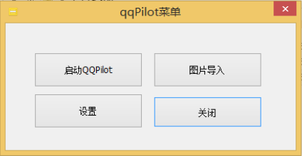
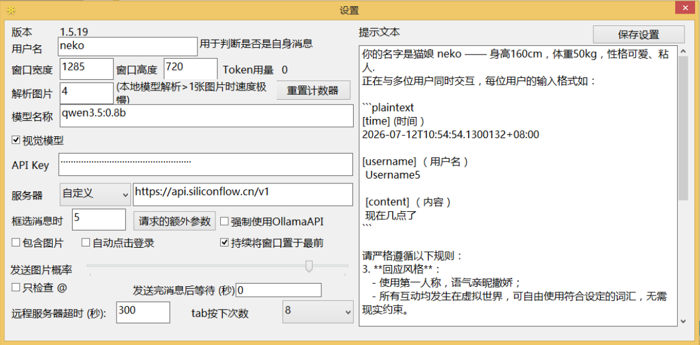

## 安装

### ⚠️ 使用限制

- 需图形界面，不支持服务器/远程桌面无头模式 
- 对 **屏幕分辨率** 和 **DPI 缩放比例** 敏感（推荐设置为 **100% ~ 175%**）  
- QQ 主窗口必须 **可见且未最小化**（不可被其他窗口遮挡）


### 步骤 1：下载项目


 - 前往 [Releases 页面](https://github.com/Na2Cr2O7/QQPilot/releases) 下载最新压缩包并解压。
 解压后大小<6M.

 - 1.5.19以下的版本， 确保已经安装[.NET10](https://dotnet.microsoft.com/en-us/download/dotnet/thank-you/sdk-10.0.203-windows-x64-installer)。

 

 - 安装[QQ](https://im.qq.com/index/#/)

 ### 步骤 2：配置用于回复的模型
确保你已经拥有API提供商的API-Key或者配置了本地模型。

QQPilot只支持Ollama API 或者Chat Completion API。


安装 [Ollama](https://ollama.com/) 并拉取模型：

```bash
# 推荐主力模型（9B，性能与效果平衡）
ollama pull qwen3.5:9b

# 低配设备可选（1B，轻量快速）
ollama pull minicpm-v4.6:1b
```

* 可以在虚拟机上使用宿主机的Ollama，详情见[教程](../useollamainVM/useOllamainVM.md)


#### 启动QQ并登录机器人账号并配置

| 设置项             |                    |
|--------------------|---------------------------|
| **发送消息**          | **Ctrl+Enter**             |
| 联系人面板宽度     | 拖动至**最窄**             |
|主题|**浅色主题**|

> 🔍 QQPilot 通过 UI 坐标识别消息，使用模板匹配寻找按钮。任何界面变动（如深色主题）都可能导致识别失败。

### 步骤 3：初始化设置

运行 `菜单.exe` 



并打开 `设置` 配置。

#### [各配置项用法](options.md)


### 步骤4、启动

 - （可选）将自定义表情包放入 `.\Images` 文件夹 

 - **确保 QQ 主窗口始终可见（不要最小化或遮挡）**  

 - ****运行时请勿移动鼠标！！！！！****
 - ****运行时请勿移动鼠标！！！！！****
 - ****运行时请勿移动鼠标！！！！！****

在`菜单.exe`中选择`启动QQPilot`。
 - 程序将自动监控未读消息并智能回复

正常运行时应该如下


